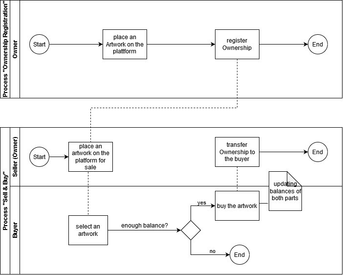

# Bazinga

## Overview

A Blockchain project to help on the one hand creators of the virtual pieces of art like memes or other immaterial assets to sell their copyrights and gain some money for that and on the other hand to represent a large selection for users who are willing to buy an immaterial asset.

A seller places his artwork on the platform and registers his ownership. A buyer selects an artwork and if his account balance is enough for a purchase, he is allowed to continue the process. The balance of the buyer is being reduced by the artwork price and the balance of the seller is being increased. The seller has to transfer the copyrights to the buyer. If the balance of the buyer does not allow the purchase, that is the end point.

## Tech Stack

* Ethereum
* Solidity
* Truffle
* React
* Morpheus Labs SEED

## Usage in Morpheus Labs SEED

### Run tests for the contracts (optional)
1. Navigate in the ethereum directory: cd BC-Group-3/ethereum
2. Start truffle development environment: truffle develop
3. Start tests: truffle test

### Deploy contracts in Morpheus Labs Ethereum Network
1. Navigate in the ethereum directory: cd BC-Group-3/ethereum
2. Deploy contracts: truffle migrate --network private_poa
3. Copy the contact address of the MarketplaceCreator

### Start the React Frontend
1. Insert the contact address of the MarketplaceCreator into the factory.js file in the ethereum directory
1. Navigate in the root directory: cd BC-Group-3
2. Install dependencies: npm install
3. Start frontend: node server.js

## Team (BC-Group-3) 

* Vitaliia Savchyn - savchyn@hm.edu
* Fabian Rittmeier - f.rittmeier@hm.edu
* Simon Hirner - simon.hirner@hm.edu

## GitHub Repository

https://github.com/HM2021-BC/BC-Group-3

## Lizenz

MIT
